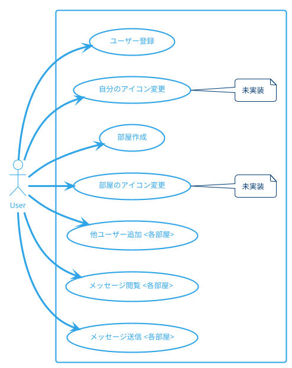
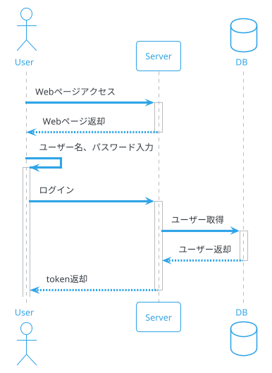
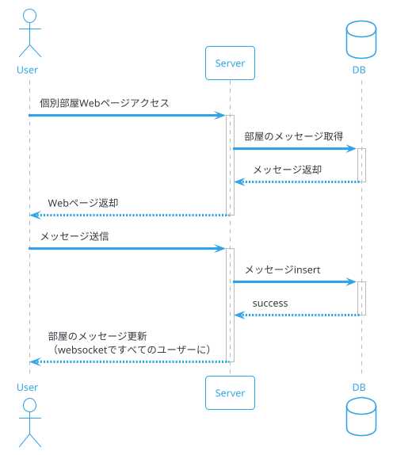
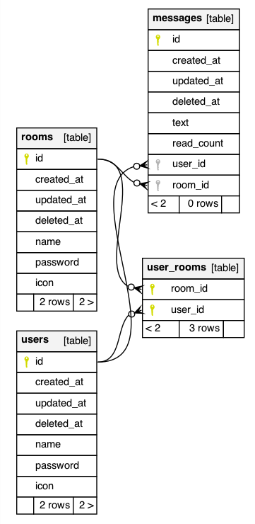

# 本アプリケーションの概要
本アプリケーションは、Lineのようなチャット機能を有する簡易チャットアプリである。

ユーザー名とパスワード、そして、本アプリの開発者から教えてもらったsercret keyを用いて、ユーザー登録ができる。

ユーザーは、任意に部屋を作成できる。

そこに他のユーザーを追加することで、チャットが可能となる。

# ユースケース
ユースケースは以下の通り。


# シーケンス
## ログイン

## メッセージ送受信


# 機能一覧
| 機能           | 説明                                                       | 備考 |
| :------------- | ---------------------------------------------------------- | ---- |
| ユーザー登録   | 任意の人間が<br>ユーザーを登録できる                       |      |
| アイコン登録   | 登録済みユーザーが<br>自分のアイコンを登録できる           |      |
| 部屋作成       | 登録済みユーザーが<br>部屋を作成できる                     |      |
| 他ユーザー追加 | 登録済みユーザーが<br>自分の部屋に他のユーザーを追加できる |      |
| メッセージ閲覧 | 登録済みユーザーが<br>自分の部屋のメッセージを閲覧できる   |      |
| メッセージ送信 | 登録済みユーザーが<br>自分の部屋でメッセージを送信できる   |      |

# 技術構成
## backend
backendのwebサーバーはGo言語で作成した。

主な使用ライブラリは以下の通り。
| 項目                         | 説明                                                                 | 備考                                |
| ---------------------------- | :------------------------------------------------------------------- | ----------------------------------- |
| github.com/labstack/echo     | webフレームワーク。                                                  |                                     |
| Logger                       | ロガー。                                                             | github.com/labstack/echo/middleware |
| Recover                      | パニックを起こしてもプログラムが<br>終了しないようにするmiddleware。 | github.com/labstack/echo/middleware |
| JWTWithConfig                | jwt tokenで認証済みのページ<br>を作成するmiddleware。                | github.com/labstack/echo/middleware |
| gorm.io/gorm                 | ORMライブラリ。                                                      |                                     |
| github.com/spf13/viper       | 設定ファイルや環境変数を<br>簡単に扱えるライブラリ。                 |                                     |
| github.com/gorilla/websocket | Websocketを<br>扱えるライブラリ。                                    |                                     |
| golang.org/x/crypto/bcrypt   | パスワードをハッシュ化するライブラリ。                               |                                     |

## frontend
frontendはNext.jsを用いて作成した。
| 項目         | 説明                                                        | 備考 |
| ------------ | :---------------------------------------------------------- | ---- |
| Next.js      | Reactベースのwebフレームワーク。                            |      |
| qrcode.react | URLから自動でQRコードの画像データ<br>を生成するライブラリ。 |      |
| recoil       | グローバルに状態を管理する<br>ライブラリ。                  |      |

## database
データベースはpostgresを使った。テーブルは以下の通り。


## deploy環境
deploy環境にもdockerをインストールしておき、docker-composeを使って、postgres及びbackendアプリをcontainerで起動させた。

このとき、port:1323でbackendアプリが起動するので、本番環境のWebサーバー（nginx）でリバースプロキシの設定をして、このアプリに接続するようにした。

# 1. ビルド手順
## ローカル環境での作業
1. 本番環境か、開発環境かによって環境変数を変える。
2. frontendアプリのbuild
   ```
   cd frontend/simple_chat
   yarn build
   ```
   これによって、`frontend/simple_chat/out`
   フォルダに、buildされる。
3. backendアプリのbuild
   ```
    cd backend
    make build
   ```
   で`./bin/main` が出来上がる。
4. frontendアプリでbuildされたoutフォルダをコピー。
   ```
   cp -r ./frontend/simple_chat/out/ ./backend/out/
   ```
5. 本番（deploy）サーバーに必要なファイルをコピー。
   ```
   simpleChat
   ├──backend
   │     ├── Dockerfile
   │     ├── bin
   │     │   └── main
   │     ├── config
   │     │   ├── config.go
   │     │   └── environments
   │     │       └── config.yaml
   │     └── out
   │         ├── 404.html
   │         ├── _next
   │         ├── add_user_to_room.html
   │         ├── create_room.html
   │         ├── favicon.ico
   │         ├── index.html
   │         ├── room
   │         │   └── [id].html
   │         ├── signup.html
   │         ├── user.html
   │         ├── user_setting.html
   │         └── vercel.svg
   ├──database
   │     ├── 01_createdb.sql
   │     └── Dockerfile
   ├──docker-compose.yml
   └──.env
   ```
## 本番サーバー側での作業
6. containerの起動
   上記でコピーしたフォルダsimpleChat内で、
  ```
  docker-compose up -d
  ```
  を実行し、containerを起動する。

7. nginxの設定
   ```
    location /chat {
      rewrite /chat/(.*) /$1 break;
      proxy_pass http://localhost:1323;
      proxy_redirect default;
    }
   ```
   でリバースプロキシを設定し、
   ```
   sudo nginx -s reload
   ```
   でnginxをreloadすると、
   https://hostname/chat/web
   でアクセスが可能となる。
   ※websocketを使うので、nginxでその設定をするのも忘れないように。

# 2. 本当はやりたいこと

password とか、環境依存系は、環境変数で制御したい。

# 3. フローチャート
