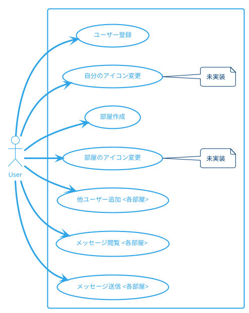

# 本アプリケーションの概要
本アプリケーションは、Lineのようなチャット機能を有する簡易チャットアプリである。

ユーザー名とパスワード、そして、本アプリの開発者から教えてもらったsercret keyを用いて、ユーザー登録ができる。

ユーザーは、任意に部屋を作成できる。

そこに他のユーザーを追加することで、チャットが可能となる。

# ユースケース
ユースケースは以下の通り。

# 機能一覧
| 機能           | 説明                                                       | 備考 |
| :------------- | ---------------------------------------------------------- | ---- |
| ユーザー登録   | 任意の人間が ユーザーを登録できる                       |      |
| アイコン登録   | 登録済みユーザーが 自分のアイコンを登録できる           |      |
| 部屋作成       | 登録済みユーザーが 部屋を作成できる                     |      |
| 他ユーザー追加 | 登録済みユーザーが 自分の部屋に他のユーザーを追加できる |      |
| メッセージ閲覧 | 登録済みユーザーが 自分の部屋のメッセージを閲覧できる   |      |
| メッセージ送信 | 登録済みユーザーが 自分の部屋でメッセージを送信できる   |      |

# 技術構成
## backend
backendのwebサーバーはGo言語で作成した。

主な使用ライブラリは以下の通り。
| 項目                         | 説明                                                                 | 備考                                |
| ---------------------------- | :------------------------------------------------------------------- | ----------------------------------- |
| github.com/labstack/echo     | webフレームワーク。                                                  |                                     |
| Logger                       | ロガー。                                                             | github.com/labstack/echo/middleware |
| Recover                      | パニックを起こしてもプログラムが 終了しないようにするmiddleware。 | github.com/labstack/echo/middleware |
| JWTWithConfig                | jwt tokenで認証済みのページ を作成するmiddleware。                | github.com/labstack/echo/middleware |
| gorm.io/gorm                 | ORMライブラリ。                                                      |                                     |
| github.com/spf13/viper       | 設定ファイルや環境変数を 簡単に扱えるライブラリ。                 |                                     |
| github.com/gorilla/websocket | Websocketを 扱えるライブラリ。                                    |                                     |
| golang.org/x/crypto/bcrypt   | パスワードをハッシュ化するライブラリ。                               |                                     |

## frontend
frontendはNext.jsを用いて作成した。
| 項目         | 説明                                                        | 備考 |
| ------------ | :---------------------------------------------------------- | ---- |
| Next.js      | Reactベースのwebフレームワーク。                            |      |
| qrcode.react | URLから自動でQRコードの画像データ を生成するライブラリ。 |      |
| recoil       | グローバルに状態を管理する ライブラリ。                  |      |

## database
データベースはpostgresを使った。

## deploy環境
deploy環境にもdockerをインストールしておき、docker-composeを使って、postgres及びbackendアプリをcontainerで起動させた。

このとき、port:1323でbackendアプリが起動するので、本番環境のWebサーバー（nginx）でリバースプロキシの設定をして、このアプリに接続するようにした。

# 1. ビルド手順

### 1.0.1. backend のビルド

    cd backend
    make build

で`./bin/main` が出来上がる。
※go の CORS 設定は解除しておかないとだめ。

## 1.1. frontend のビルド

まず最初に、global.jsのdomain_dbとdomainをコンテナの host に書き換える。次にデプロイ先のサブディレクトリを指定するために、

    cd frontend
    yarn build

 このあと、作成された out ファイルを webserver フォルダに移動。
※next の`<Image />`が入ってるとうまく行かないので、今回は使わない。``タグを変わりに使った。

# 2. 本当はやりたいこと

password とか、環境依存系は、環境変数で制御したい。

# 3. フローチャート
